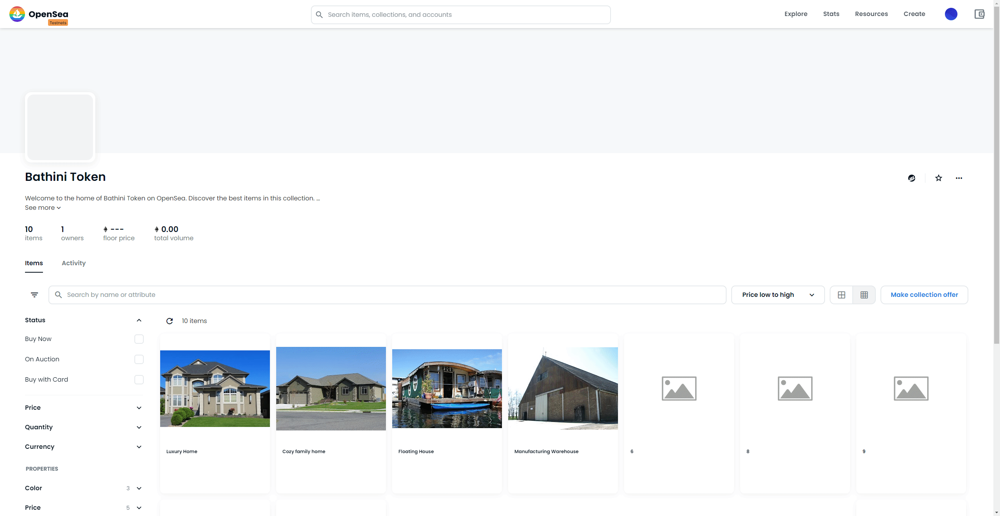

<p align="center">
  <h3 align="center">Real Estate</h3>

  <p align="center">
Real Estate Marketplace Dapp. Part of the Udacity Blockchain Nanodegree.
    <br>
    </p>
</p>

<br>

## Table of contents

- [About the Website](#about-the-website)
- [Technical](#technical)
- [Design](#design)
- [Testing](#testing)
- [Licence](#license)
- [Versions](#versions)
- [Contact Information](#contact-information)

### About the website

An ERC721 token is minted to represent the title to the property. Before minting your property, one needs to proof that they nown the property. zk-SNARKS are used to create a verification system which can prove that one has the title to the property without revealing the specific information about the property. The properties are then visible on **OpenSea** test environment.

<p align="center">
  
</p>

### Technical

#### Technology Used

This project uses: NodeJS - Web3.JS - Truffle - Ganache

- Truffle version `v5.5.15`
- Ganache version `v^7.1.0`
- Solidity version `v0.5.16`
- Node js version `v16.15.0`
- Web3 version `v1.5.3`

Contracts

- Verifier, ERC721, SolnSquareVerifier are deployed under the address `0xBd176872f0a3DaBe117BE128C0580993F547869a `, to view on block explorer, see [here](https://rinkeby.etherscan.io/address/0xBd176872f0a3DaBe117BE128C0580993F547869a)

OpenSea Collection

- The opensea collection can be found [here](https://testnets.opensea.io/collection/bathini-token). There are 10 properties which are minted (instead of 5). Two properties have bids on them. One of the property [is](https://testnets.opensea.io/assets/rinkeby/0xa39fd52147cd7320e164e4017dada772ee9b75bb/4) and the other property [is](https://testnets.opensea.io/assets/rinkeby/0xa39fd52147cd7320e164e4017dada772ee9b75bb/2)

#### Running the project

##### Contract

Ensure node is running on `v16`. Do this, ensure you have [node version manager](https://github.com/nvm-sh/nvm) installed. Once installed you can then run.

```console
nvm install 16
nvm use 16
```

A `.secret` file needs to be created at the root of the project with the private key of the account to deploy the contract. This has already been done.

Ensure all npm packages are installing, by running the command below the root of the project

```console
npm install
```

To run a local blockchain within your machine, run:

```console
ganache
```

To compile the smart contract, within another terminal window, ensure you are in the `eth-contracts` directory. Once you are there you can run:

```console
truffle compile
```

To migrate and create a fresh and clean smart contract session, within the truffle development environment, run:

```console
truffle migrate --refresh
```

To migrate and create a fresh and clean smart contract session, on the rinkeby testnet, run:

```console
truffle migrate --refresh --network rinkeby
```

To run the test cases within the truffle development environment, run:

```console
truffle test
```

##### Generating Proofs

Ensure you have docker installed and running. To install docker, see [here](https://docs.docker.com/engine/install/). From the home directory of the project, you can then run

```console
docker run -v `pwd`/zokrates/code/:/home/zokrates/code -ti zokrates/zokrates /bin/bash
```

This opens a bash window. From here navigate inside the `code/square/` directory

```console
cd code/square/
```

From here you can now compile the zokrates file that you created.

```console
~/zokrates compile -i square.zok
```

Generate the trusted setup by running

```console
~/zokrates setup
```

Compute witness by running

```console
~/zokrates compute-witness -a 5 25
```

You can now generate proofs by running

```console
~/zokrates generate-proof
```

Proofs are written out to `proof.json`. To create multiple proofs under different filenames, you can use the `-j` option. For example

```console
~/zokrates generate-proof -j proof_1.json
```

Export the verifier by running

```console
~/zokrates export-verifier
```

##### Submitting proofs, mints

To mint tokens on rinkeby, the `mint.js` file can be run. The file

- Gets the seed from the `.secret file` within the contracts file
- Instantiates the contract running on Rinkeby
- Submits proofs to the contract running on Rinkeby and also mints a token for it
- Ensure the `appAddress` is correct and the `infuraKey` is also correct

Ensure the node modules are installed at the root of the project. This can be done by running:

```console
npm install
```

Then you can run

```console
cd eth-contracts
node mint.js
```

You can then check etherscan to see if the whole process was successful.

### Testing

To test the full application, ensure you have a local blockchain running. You can use this by running:

```console
ganache
```

Compile the smart contract, within another terminal window. Ensure you are in the `eth-contracts` directory. Once you are there you can run:

```console
truffle compile
```

To migrate and create a fresh and clean smart contract session, within the truffle development environment, run:

```console
truffle migrate --refresh
```

To run the test cases within the truffle development environment, run:

```console
truffle test
```

### CONTRIBUTING

I would/ We'd love to have your help in making **Real-Estate** better. The project is still very incomplete, but if there's an issue you'd like to see addressed sooner rather than later, let me(/us) know.

Before you contribute though read the contributing guide here: [Contributing.md](https://github.com/peterokwara/Real-Estate/blob/master/CONTRIBUTING.md)

For any concerns, please open an [issue](https://github.com/peterokwara/Real-Estate/issues), or just, [fork the project and send a pull request](https://github.com/peterokwara/Real-Estate/pulls).

<hr>

### License

- see [LICENSE](https://github.com/peterokwara/Real-Estate/blob/master/LICENSE.md) file

### Versions

- Version 1.0 DATE 26/06/2022

### Contact Information

If you have found any bugs, or have any feedback or questions and or want to post a feature request please use the [Issuetracker](https://github.com/peterokwara/Real-Estate/issues) to report them.

<hr>

[](#)

<br>

[](https://github.com/peterokwara/Real-Estate/blob/master/LICENSE.md)
